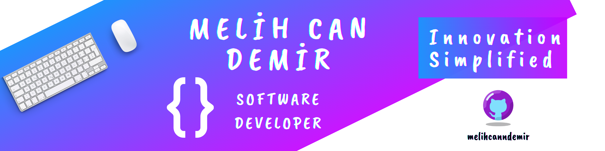

  

  
  
  
  
  
  

  Passionate Android developer crafting mindful apps with elegant architecture.

---

- 🔭 Currently working on **Mindbook**
- ☠️ TypeScript purist — strict or nothing.
- 💬 Ask me about **Android**, **React Native**, and **Clean Architecture**
- 👨‍💻 My apps are available on [Google Play Store](https://bit.ly/melihcan)
- 📫 Reach me at **melihcandemir@protonmail.com**

---

<h3 align="left">Connect with me</h3>

  
  
  <!--  -->

---

<h3 align="left">Languages & Tools</h3>

  
  
  
  
  
  
  
  
  
  
  
  <!-- Supabase -->
  
  <!-- Firebase -->
  

---

  
  

  

  

